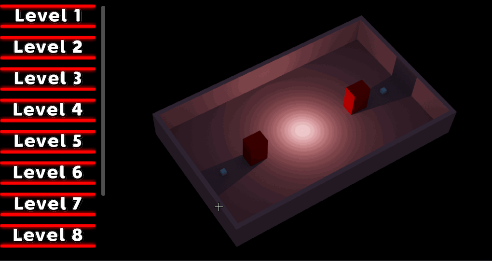
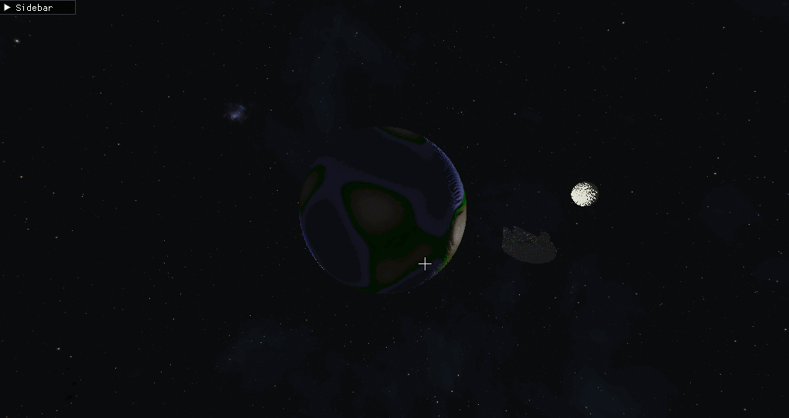
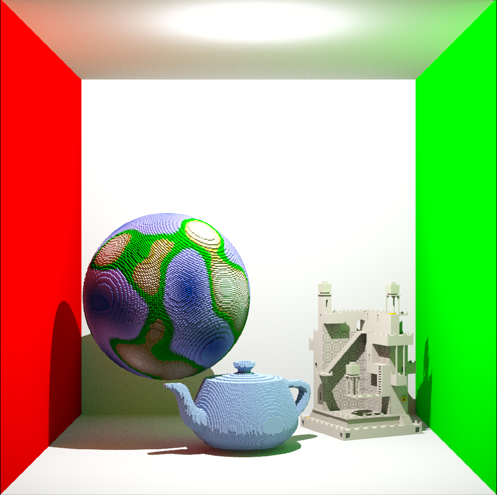
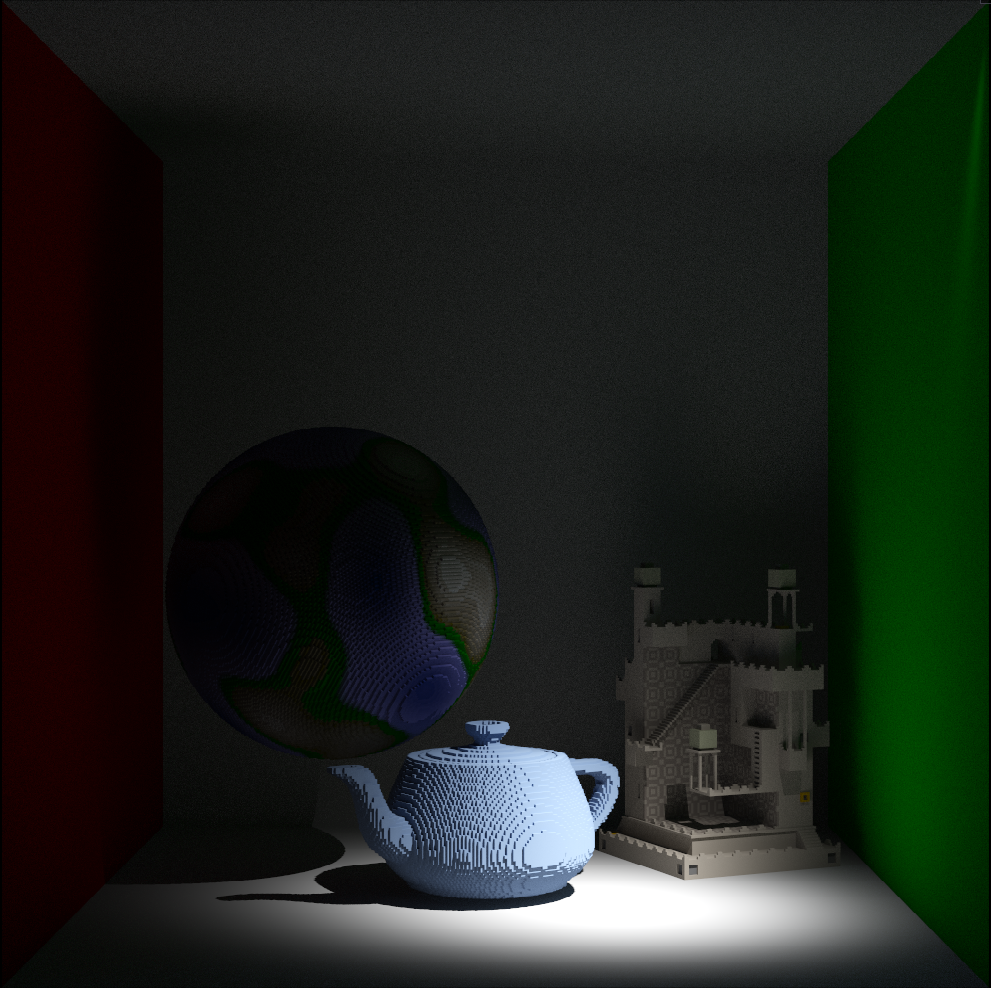
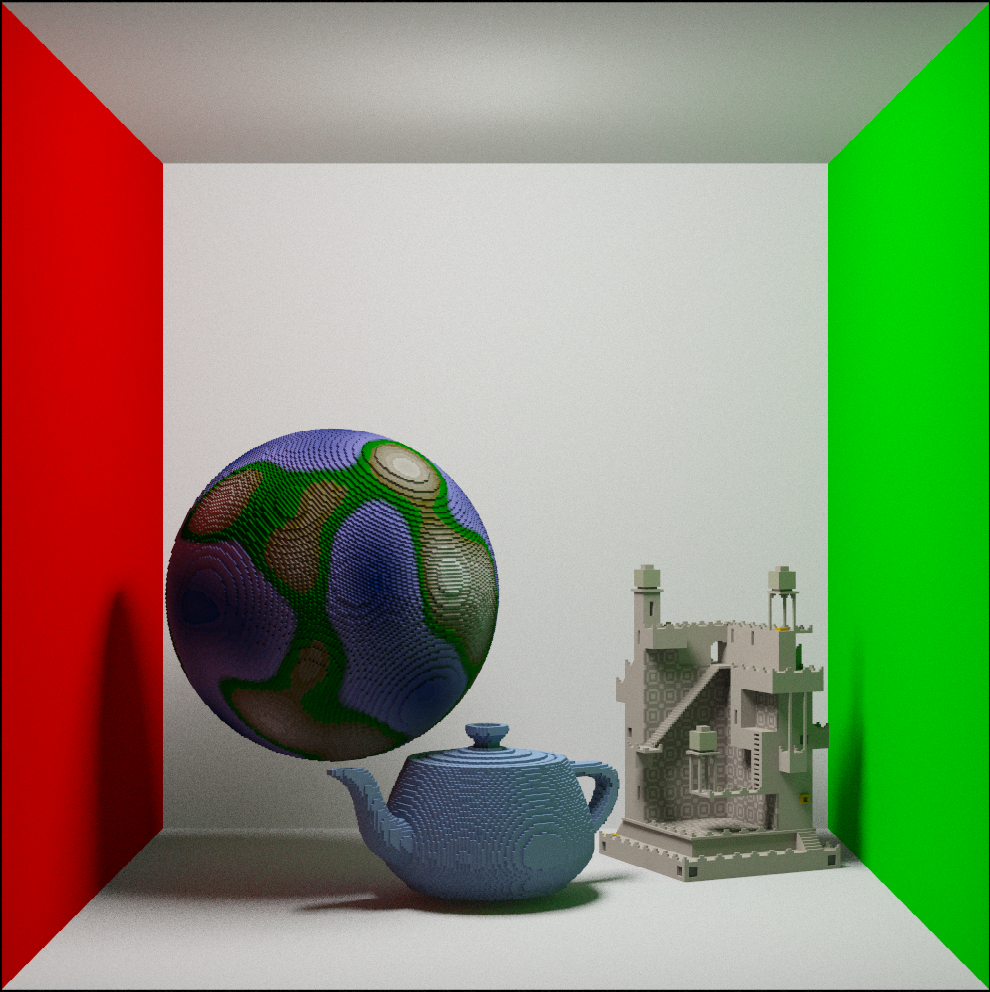

# cpu-tracer

A voxel-based ray tracer written in C++ that runs on the CPU made in 8 weeks.

This was one of my favorite projects during my first year at Breda University of Applied Sciences. I learned a lot about ray tracing and specifically about optimizations. Including multithreading, SIMD, cpu cache, etc.

## How to run

- Download the project and open the .sln file in Visual Studio.
- Run the ``voxpopuli`` project with Release on x64.

## The Game

After the 6 week of developing the ray tracing engine, I had 2 weeks to make a game using the engine. During which I made 2 small games.

The first game was a simple puzzle game where you could move a light source around the scene. The goal is to light up all the cubes in the scene and to figure out where to place the light source so that all the cubes meet their requirements. Because some cubes need to be lit up and others need to be in the shadow.

> [!CAUTION]
> Gif contains spoilers for the solutions.

The second game was more of a showcase and a play demo of the engine that an actual game. You can move around the globe and shoot meteorites, while the sun (that lights up the scene) and a Millennium Falcon rotate around the globe.

## Showcase

### Spot Light

### Cone Light

### Area Light

Check my [portfolio](https://www.svenvh.nl/article/Block-C.html) for more information.

## Credits

Starting point for this project is the [Voxpopuli](https://github.com/jbikker/voxpopuli) made by my teacher [Jacco Bikker](https://github.com/jbikker).

Made during block C of my first year at Breda University of Applied Sciences.
